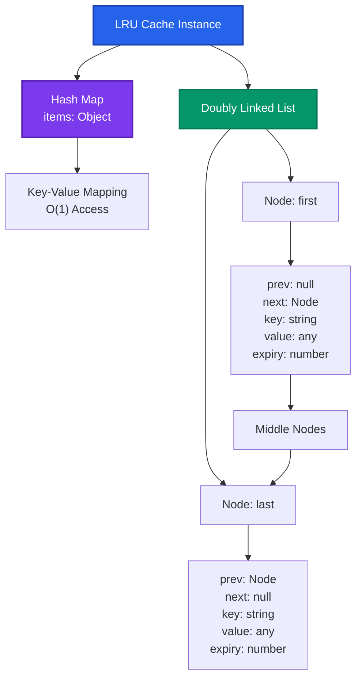
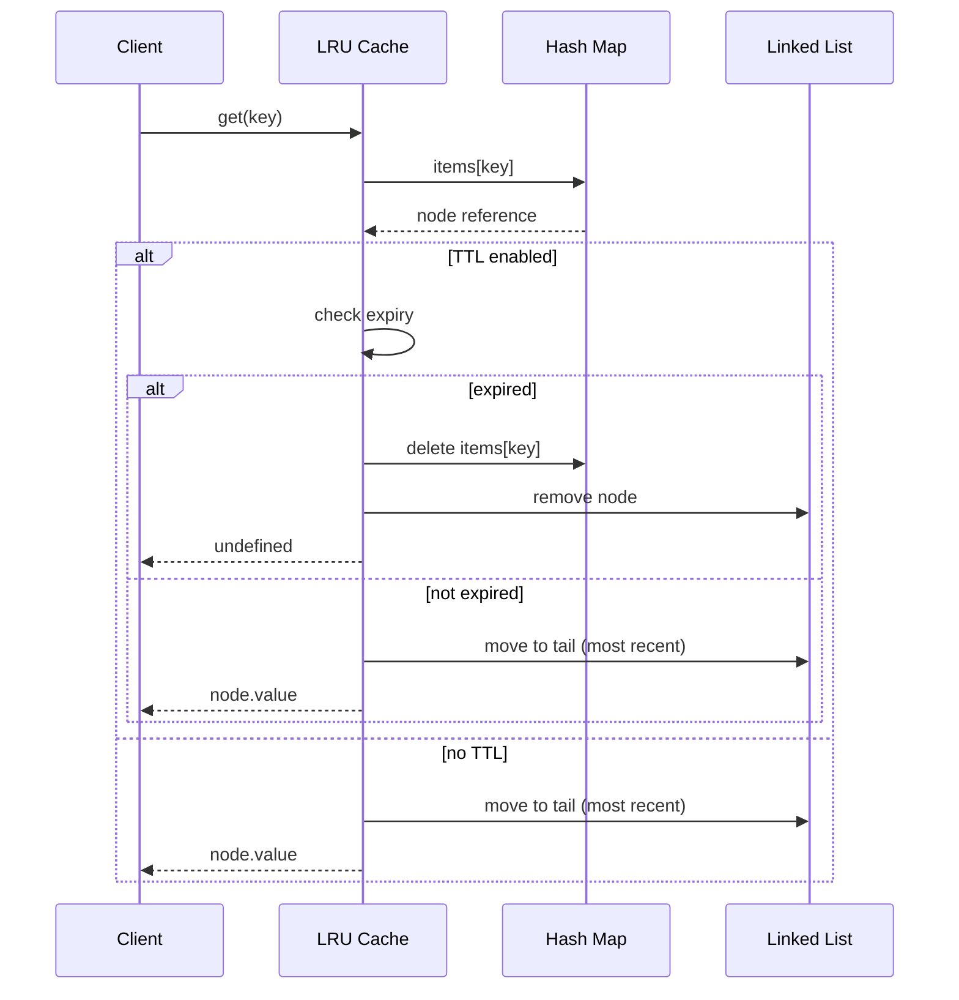
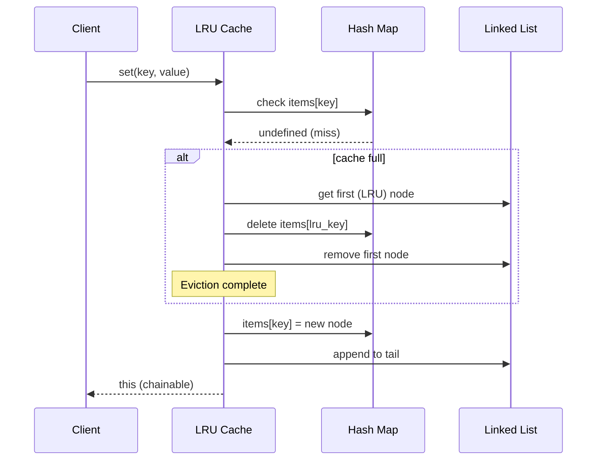
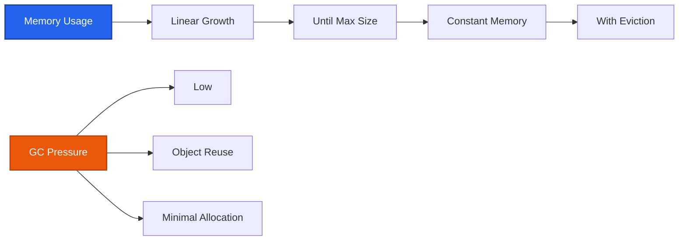
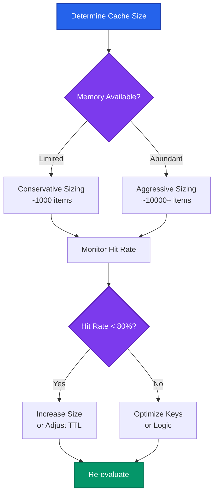

# Technical Documentation

## Overview

The tiny-lru library provides a high-performance, memory-efficient Least Recently Used (LRU) cache implementation with optional Time-To-Live (TTL) support. This document covers the technical architecture, data flow, modern usage patterns, and security considerations for production applications.

## Table of Contents

- [Architecture Overview](#architecture-overview)
- [Data Flow](#data-flow)
- [Core Operations](#core-operations)
- [Modern Usage Patterns](#modern-usage-patterns)
- [Security Considerations](#security-considerations)
- [Performance Characteristics](#performance-characteristics)
- [Integration Examples](#integration-examples)
- [Best Practices](#best-practices)

## Architecture Overview

The LRU cache implements a doubly-linked list combined with a hash map for O(1) operations on both insertion and retrieval.

> **Accessibility Note**: All diagrams use WCAG AA compliant colors with sufficient contrast ratios (>4.5:1) that work on both light and dark backgrounds. Colors are combined with distinct shapes and borders to ensure accessibility for users with color vision deficiencies.



### Core Components

- **Hash Map**: Provides O(1) key-based access to cache nodes
- **Doubly Linked List**: Maintains LRU order with O(1) insertion/deletion
- **Cache Nodes**: Store key, value, expiry, and linked list pointers
- **TTL Manager**: Handles time-based expiration (optional)

## Data Flow

### Cache Hit Scenario



### Cache Miss and Eviction Scenario



## Core Operations

### Time Complexity

| Operation | Average Case | Worst Case | Space |
|-----------|--------------|------------|-------|
| `get(key)` | O(1) | O(1) | O(1) |
| `set(key, value)` | O(1) | O(1) | O(1) |
| `delete(key)` | O(1) | O(1) | O(1) |
| `has(key)` | O(1) | O(1) | O(1) |
| `clear()` | O(1) | O(1) | O(1) |
| `keys()` | O(n) | O(n) | O(n) |
| `values()` | O(n) | O(n) | O(n) |

### Memory Usage

- **Per Node**: ~120 bytes (key + value + pointers + metadata)
- **Base Overhead**: ~200 bytes (class instance + hash map)
- **Total**: `base + (nodes × 120)` bytes approximately

## Modern Usage Patterns

### 1. LLM Response Caching

Cache expensive AI model responses with content-based keys and reasonable TTLs.

```javascript
import { LRU } from 'tiny-lru';

class LLMCache {
    constructor() {
        // Cache up to 1000 responses for 1 hour
        this.cache = new LRU(1000, 3600000); // 1 hour TTL
    }
    
    /**
     * Generate cache key for LLM request
     * @param {string} model - Model identifier
     * @param {string} prompt - User prompt
     * @param {object} params - Model parameters
     */
    generateKey(model, prompt, params = {}) {
        const paramsHash = this.hashObject(params);
        const promptHash = this.hashString(prompt);
        return `llm:${model}:${promptHash}:${paramsHash}`;
    }
    
    async getResponse(model, prompt, params = {}) {
        const key = this.generateKey(model, prompt, params);
        
        // Check cache first
        const cached = this.cache.get(key);
        if (cached) {
            return { ...cached, fromCache: true };
        }
        
        // Make expensive API call
        const response = await this.callLLMAPI(model, prompt, params);
        
        // Cache the response
        this.cache.set(key, {
            response: response.text,
            tokens: response.tokens,
            timestamp: Date.now()
        });
        
        return { ...response, fromCache: false };
    }
    
    hashString(str) {
        // Simple hash function for demonstration
        let hash = 0;
        for (let i = 0; i < str.length; i++) {
            const char = str.charCodeAt(i);
            hash = ((hash << 5) - hash) + char;
            hash = hash & hash; // Convert to 32-bit integer
        }
        return Math.abs(hash).toString(36);
    }
    
    hashObject(obj) {
        return this.hashString(JSON.stringify(obj, Object.keys(obj).sort()));
    }
}
```

### 2. API Response Caching with Rate Limiting

Cache external API responses with different TTLs based on data sensitivity.

```javascript
import { LRU } from 'tiny-lru';

class APICache {
    constructor() {
        this.caches = {
            // Fast-changing data: 5 minutes
            realtime: new LRU(500, 300000),
            // Moderate data: 30 minutes  
            standard: new LRU(1000, 1800000),
            // Stable data: 24 hours
            stable: new LRU(2000, 86400000)
        };
    }
    
    async fetchUserProfile(userId, domain = 'users') {
        const key = `${domain}:profile:${userId}`;
        const cache = this.caches.standard;
        
        const cached = cache.get(key);
        if (cached) {
            return cached;
        }
        
        const profile = await fetch(`/api/users/${userId}`).then(r => r.json());
        cache.set(key, profile);
        
        return profile;
    }
    
    async fetchRealtimeData(symbol, domain = 'market') {
        const key = `${domain}:price:${symbol}`;
        const cache = this.caches.realtime;
        
        const cached = cache.get(key);
        if (cached) {
            return cached;
        }
        
        const data = await fetch(`/api/market/${symbol}`).then(r => r.json());
        cache.set(key, data);
        
        return data;
    }
}
```

### 3. Database Query Result Caching

Cache expensive database queries with intelligent cache invalidation.

```javascript
import { LRU } from 'tiny-lru';

class QueryCache {
    constructor() {
        // No TTL - manual invalidation
        this.cache = new LRU(10000);
        this.dependencyMap = new Map(); // Track query dependencies
    }
    
    async query(sql, params = [], dependencies = []) {
        const key = this.generateQueryKey(sql, params);
        
        const cached = this.cache.get(key);
        if (cached) {
            return cached;
        }
        
        const result = await this.executeQuery(sql, params);
        this.cache.set(key, result);
        
        // Track dependencies for invalidation
        this.trackDependencies(key, dependencies);
        
        return result;
    }
    
    generateQueryKey(sql, params) {
        const sqlHash = this.hashString(sql.replace(/\s+/g, ' ').trim());
        const paramsHash = this.hashString(JSON.stringify(params));
        return `query:${sqlHash}:${paramsHash}`;
    }
    
    // Invalidate cache when specific tables change
    invalidateByTable(tableName) {
        const keysToDelete = [];
        
        for (const [key, deps] of this.dependencyMap.entries()) {
            if (deps.includes(tableName)) {
                keysToDelete.push(key);
            }
        }
        
        keysToDelete.forEach(key => {
            this.cache.delete(key);
            this.dependencyMap.delete(key);
        });
    }
    
    trackDependencies(key, dependencies) {
        if (dependencies.length > 0) {
            this.dependencyMap.set(key, dependencies);
        }
    }
}
```

### 4. Session and Authentication Caching

Cache user sessions and authentication tokens with proper security.

```javascript
import { LRU } from 'tiny-lru';

class AuthCache {
    constructor() {
        // Session cache: 30 minutes with TTL reset on access
        this.sessions = new LRU(10000, 1800000, true);
        // Token validation cache: 5 minutes, no reset
        this.tokens = new LRU(5000, 300000, false);
        // Permission cache: 15 minutes
        this.permissions = new LRU(5000, 900000);
    }
    
    cacheSession(sessionId, userData, domain = 'app') {
        const key = `${domain}:session:${sessionId}`;
        this.sessions.set(key, {
            userId: userData.userId,
            permissions: userData.permissions,
            loginTime: Date.now(),
            lastActivity: Date.now()
        });
    }
    
    getSession(sessionId, domain = 'app') {
        const key = `${domain}:session:${sessionId}`;
        return this.sessions.get(key);
    }
    
    cacheTokenValidation(tokenHash, isValid, userId = null) {
        const key = `auth:token:${tokenHash}`;
        this.tokens.set(key, { isValid, userId, validatedAt: Date.now() });
    }
    
    isTokenValid(tokenHash) {
        const key = `auth:token:${tokenHash}`;
        const cached = this.tokens.get(key);
        return cached?.isValid || false;
    }
}
```

## Security Considerations

### Multi-Domain Key Convention

Implement a hierarchical key naming convention to prevent cross-domain data leakage and improve operational security.

#### Key Format Specification

```
{domain}:{service}:{resource}:{identifier}[:{version}]
```

#### Domain Categories

```javascript
const DOMAIN_PREFIXES = {
    // User-related data
    USER: 'usr',
    // Authentication & authorization  
    AUTH: 'auth',
    // External API responses
    API: 'api',
    // Database query results
    DB: 'db',
    // Application logic
    APP: 'app',
    // System/infrastructure
    SYS: 'sys',
    // Analytics & metrics
    ANALYTICS: 'analytics',
    // Machine learning / AI
    ML: 'ml'
};

const SERVICE_PREFIXES = {
    // Authentication services
    LOGIN: 'login',
    LOGOUT: 'logout',
    REFRESH: 'refresh',
    // Data services
    PROFILE: 'profile',
    SETTINGS: 'settings',
    // External integrations
    PAYMENT: 'payment',
    EMAIL: 'email',
    SMS: 'sms'
};
```

#### Implementation Example

```javascript
class SecureKeyManager {
    constructor(domain, service) {
        this.domain = domain;
        this.service = service;
        this.separator = ':';
    }
    
    generateKey(resource, identifier, version = null) {
        const parts = [this.domain, this.service, resource, identifier];
        if (version) parts.push(version);
        
        return parts.join(this.separator);
    }
    
    parseKey(key) {
        const parts = key.split(this.separator);
        return {
            domain: parts[0],
            service: parts[1], 
            resource: parts[2],
            identifier: parts[3],
            version: parts[4] || null
        };
    }
    
    // Validate key follows security convention
    validateKey(key) {
        const parts = key.split(this.separator);
        
        if (parts.length < 4 || parts.length > 5) {
            throw new Error('Invalid key format: must have 4-5 parts');
        }
        
        if (!Object.values(DOMAIN_PREFIXES).includes(parts[0])) {
            throw new Error(`Invalid domain prefix: ${parts[0]}`);
        }
        
        return true;
    }
}

// Usage examples
const authKeys = new SecureKeyManager(DOMAIN_PREFIXES.AUTH, SERVICE_PREFIXES.LOGIN);
const userKeys = new SecureKeyManager(DOMAIN_PREFIXES.USER, SERVICE_PREFIXES.PROFILE);
const mlKeys = new SecureKeyManager(DOMAIN_PREFIXES.ML, 'llm');

// Generate secure keys
const sessionKey = authKeys.generateKey('session', 'abc123def456');
// Result: "auth:login:session:abc123def456"

const profileKey = userKeys.generateKey('data', '12345', 'v2');  
// Result: "usr:profile:data:12345:v2"

const llmKey = mlKeys.generateKey('response', 'gpt4-prompt-hash');
// Result: "ml:llm:response:gpt4-prompt-hash"
```

### Cache Isolation

```javascript
class IsolatedCacheManager {
    constructor() {
        this.caches = new Map();
    }
    
    getCache(domain, service, maxSize = 1000, ttl = 0) {
        const cacheKey = `${domain}:${service}`;
        
        if (!this.caches.has(cacheKey)) {
            this.caches.set(cacheKey, new LRU(maxSize, ttl));
        }
        
        return this.caches.get(cacheKey);
    }
    
    // Secure method to access only your domain's cache
    accessCache(domain, service, operation, ...args) {
        if (!this.isAuthorized(domain, service)) {
            throw new Error('Unauthorized cache access');
        }
        
        const cache = this.getCache(domain, service);
        return cache[operation](...args);
    }
    
    isAuthorized(domain, service) {
        // Implement your authorization logic
        return true; // Simplified for example
    }
    
    // Clear caches by domain for security incidents
    clearDomain(domain) {
        for (const [key, cache] of this.caches.entries()) {
            if (key.startsWith(`${domain}:`)) {
                cache.clear();
            }
        }
    }
}
```

## Performance Characteristics

### Benchmarking Setup

```javascript
// Performance testing setup
import { LRU } from 'tiny-lru';
import { performance } from 'perf_hooks';

class PerformanceTester {
    constructor() {
        this.cache = new LRU(10000);
    }
    
    async benchmarkOperations(iterations = 100000) {
        const results = {};
        
        // Benchmark set operations
        const setStart = performance.now();
        for (let i = 0; i < iterations; i++) {
            this.cache.set(`key_${i}`, `value_${i}`);
        }
        const setEnd = performance.now();
        results.setOpsPerSecond = iterations / ((setEnd - setStart) / 1000);
        
        // Benchmark get operations
        const getStart = performance.now();
        for (let i = 0; i < iterations; i++) {
            this.cache.get(`key_${i % 5000}`); // Mix hits and misses
        }
        const getEnd = performance.now();
        results.getOpsPerSecond = iterations / ((getEnd - getStart) / 1000);
        
        return results;
    }
}
```

### Memory Usage Patterns



## Integration Examples

### Express.js Middleware

```javascript
import { LRU } from 'tiny-lru';

function createCacheMiddleware(options = {}) {
    const cache = new LRU(
        options.maxSize || 1000,
        options.ttl || 300000 // 5 minutes default
    );
    
    return (req, res, next) => {
        // Generate cache key from request
        const key = `http:${req.method}:${req.path}:${JSON.stringify(req.query)}`;
        
        // Check cache
        const cached = cache.get(key);
        if (cached) {
            res.set(cached.headers);
            return res.status(cached.status).json(cached.data);
        }
        
        // Intercept response
        const originalSend = res.json;
        res.json = function(data) {
            // Cache successful responses
            if (res.statusCode < 400) {
                cache.set(key, {
                    status: res.statusCode,
                    headers: res.getHeaders(),
                    data: data
                });
            }
            
            return originalSend.call(this, data);
        };
        
        next();
    };
}

// Usage
app.use('/api/users', createCacheMiddleware({ ttl: 600000 })); // 10 minutes
```

### React Cache Hook

```javascript
import { useMemo, useRef } from 'react';
import { LRU } from 'tiny-lru';

function useCache(maxSize = 100, ttl = 300000) {
    const cache = useRef(null);
    
    if (!cache.current) {
        cache.current = new LRU(maxSize, ttl);
    }
    
    const memoizedCache = useMemo(() => ({
        get: (key) => cache.current.get(key),
        set: (key, value) => cache.current.set(key, value),
        delete: (key) => cache.current.delete(key),
        clear: () => cache.current.clear(),
        has: (key) => cache.current.has(key)
    }), []);
    
    return memoizedCache;
}

// Usage in component
function UserProfile({ userId }) {
    const cache = useCache(50, 600000); // 10 minutes
    const [profile, setProfile] = useState(null);
    
    useEffect(() => {
        const cacheKey = `usr:profile:data:${userId}`;
        const cached = cache.get(cacheKey);
        
        if (cached) {
            setProfile(cached);
        } else {
            fetchUserProfile(userId).then(data => {
                cache.set(cacheKey, data);
                setProfile(data);
            });
        }
    }, [userId, cache]);
    
    return <div>{/* render profile */}</div>;
}
```

## Best Practices

### 1. Cache Sizing Strategy



### 2. TTL Selection Guidelines

| Data Type | Recommended TTL | Rationale |
|-----------|----------------|-----------|
| User Sessions | 30-60 minutes | Balance security and UX |
| API Responses | 5-30 minutes | Depends on data freshness needs |
| Database Queries | 15-60 minutes | Based on update frequency |
| LLM Responses | 1-24 hours | Expensive to regenerate |
| Static Content | 24+ hours | Rarely changes |

### 3. Error Handling

```javascript
class RobustCache {
    constructor(maxSize, ttl) {
        try {
            this.cache = new LRU(maxSize, ttl);
        } catch (error) {
            console.error('Cache initialization failed:', error);
            this.cache = null;
        }
    }
    
    safeGet(key) {
        try {
            return this.cache?.get(key);
        } catch (error) {
            console.error('Cache get failed:', error);
            return undefined;
        }
    }
    
    safeSet(key, value) {
        try {
            return this.cache?.set(key, value);
        } catch (error) {
            console.error('Cache set failed:', error);
            return false;
        }
    }
}
```

### 4. Monitoring and Metrics

```javascript
class MonitoredCache {
    constructor(maxSize, ttl) {
        this.cache = new LRU(maxSize, ttl);
        this.metrics = {
            hits: 0,
            misses: 0,
            sets: 0,
            deletes: 0,
            evictions: 0
        };
    }
    
    get(key) {
        const value = this.cache.get(key);
        this.metrics[value !== undefined ? 'hits' : 'misses']++;
        return value;
    }
    
    set(key, value) {
        const hadKey = this.cache.has(key);
        const wasAtCapacity = this.cache.size >= this.cache.max;
        
        const result = this.cache.set(key, value);
        
        this.metrics.sets++;
        if (!hadKey && wasAtCapacity && this.cache.max > 0) {
            this.metrics.evictions++;
        }
        
        return result;
    }
    
    getHitRate() {
        const total = this.metrics.hits + this.metrics.misses;
        return total > 0 ? this.metrics.hits / total : 0;
    }
    
    getMetrics() {
        return {
            ...this.metrics,
            hitRate: this.getHitRate(),
            size: this.cache.size,
            maxSize: this.cache.max
        };
    }
}
```

## Conclusion

The tiny-lru library provides a robust foundation for caching in modern applications. By following these patterns, security guidelines, and best practices, you can build efficient, secure, and maintainable caching solutions for contemporary use cases including AI/ML applications, API gateways, and high-performance web services.

Remember to:
- Use proper key namespacing for security
- Monitor cache performance and hit rates
- Implement appropriate TTL strategies
- Handle errors gracefully
- Consider memory constraints in your sizing decisions 