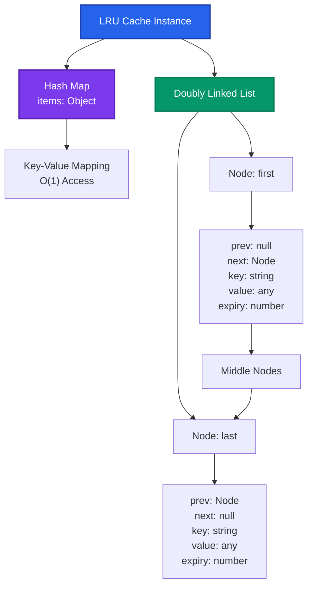
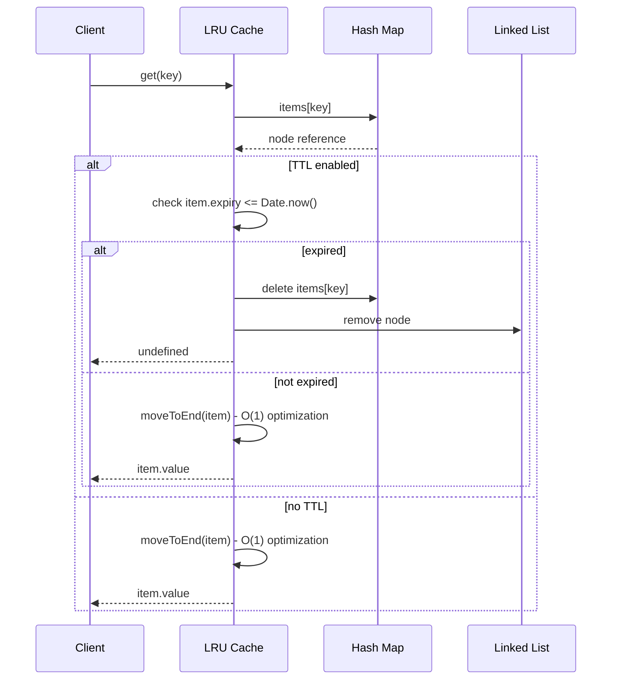
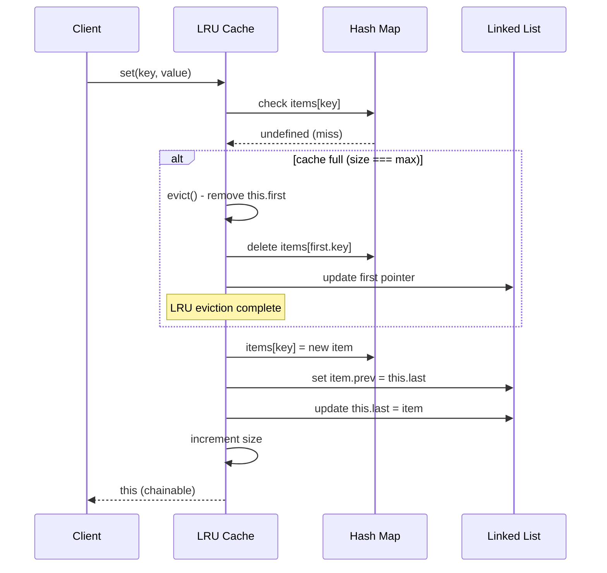
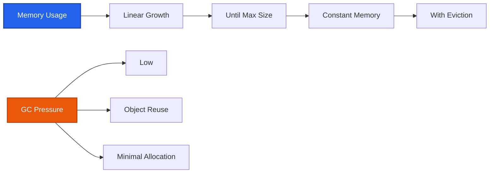
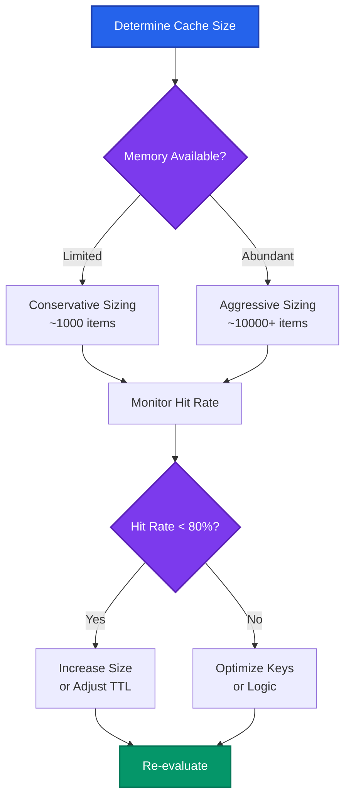

# Technical Documentation

## Overview

The tiny-lru library provides a high-performance, memory-efficient Least Recently Used (LRU) cache implementation with optional Time-To-Live (TTL) support. This document covers the technical architecture, data flow, modern usage patterns, and security considerations for production applications.

## Table of Contents

- [Architecture Overview](#architecture-overview)
- [Data Flow](#data-flow)
- [Core Operations](#core-operations)
- [Mathematical Representation](#mathematical-representation)
- [TypeScript Support](#typescript-support)
- [Modern Usage Patterns](#modern-usage-patterns)
- [Security Considerations](#security-considerations)
- [Performance Characteristics](#performance-characteristics)
- [Integration Examples](#integration-examples)
- [Best Practices](#best-practices)
- [Build Configuration and Distribution](#build-configuration-and-distribution)

## Architecture Overview

The LRU cache implements a doubly-linked list combined with a hash map for O(1) operations on both insertion and retrieval.

> **Accessibility Note**: All diagrams use WCAG AA compliant colors with sufficient contrast ratios (>4.5:1) that work on both light and dark backgrounds. Colors are combined with distinct shapes and borders to ensure accessibility for users with color vision deficiencies.



### Core Components

- **Hash Map (`items`)**: Object.create(null) providing O(1) key-based access to cache nodes
- **Doubly Linked List**: Maintains LRU order with `first` and `last` pointers for O(1) insertion/deletion
- **Cache Nodes**: Store key, value, expiry timestamp, and linked list pointers (prev/next)
- **LRU Class Properties**:
  - `first`: Pointer to least recently used item
  - `last`: Pointer to most recently used item
  - `items`: Hash map for O(1) key lookup
  - `max`: Maximum cache size (0 = unlimited)
  - `size`: Current number of items
  - `ttl`: Time-to-live in milliseconds (0 = no expiration)
  - `resetTtl`: Whether to reset TTL on access

## Data Flow

### Cache Hit Scenario



### Cache Miss and Eviction Scenario



## Core Operations

### Time Complexity

| Operation | Average Case | Worst Case | Space | Description |
|-----------|--------------|------------|-------|-------------|
| `get(key)` | O(1) | O(1) | O(1) | Retrieve value and move to end |
| `set(key, value)` | O(1) | O(1) | O(1) | Store value, evict if needed |
| `setWithEvicted(key, value)` | O(1) | O(1) | O(1) | Store value, return evicted item |
| `delete(key)` | O(1) | O(1) | O(1) | Remove item from cache |
| `has(key)` | O(1) | O(1) | O(1) | Check key existence |
| `clear()` | O(1) | O(1) | O(1) | Reset all pointers |
| `evict()` | O(1) | O(1) | O(1) | Remove least recently used item |
| `expiresAt(key)` | O(1) | O(1) | O(1) | Get expiration timestamp |
| `moveToEnd(item)` | O(1) | O(1) | O(1) | Internal: optimize LRU positioning |
| `keys()` | O(n) | O(n) | O(n) | Array of all keys in LRU order |
| `values(keys?)` | O(n) | O(n) | O(n) | Array of values for specified keys |
| `entries(keys?)` | O(n) | O(n) | O(n) | Array of [key, value] pairs |

### Memory Usage

- **Per Node**: ~120 bytes (key + value + pointers + metadata)
- **Base Overhead**: ~200 bytes (class instance + hash map)
- **Total**: `base + (nodes × 120)` bytes approximately

## Mathematical Representation

### Core Operations

The LRU cache maintains a doubly-linked list $L$ and a hash table $H$ for O(1) operations:

**Data Structure:**
- $L = (first, last, size)$ - Doubly-linked list with head/tail pointers
- $H: K \rightarrow \{key: K, value: V, prev: Object, next: Object, expiry: \mathbb{N}_0\}$ - Hash table mapping keys to item objects
- $max \in \mathbb{N}_0$ - Maximum cache size (0 = unlimited)
- $ttl \in \mathbb{N}_0$ - Time-to-live in milliseconds
- $resetTtl \in \{\text{true}, \text{false}\}$ - Whether to reset TTL on set() operations

**Core Methods:**

#### Set Operation: $set(k, v, bypass = false, resetTtl = resetTtl) \rightarrow \text{LRU}$
$$\begin{align}
set(k, v, bypass, resetTtl) &= \begin{cases}
update(k, v, bypass, resetTtl) & \text{if } k \in H \\
insert(k, v) & \text{if } k \notin H
\end{cases} \\
update(k, v, bypass, resetTtl) &= H[k].value \leftarrow v \land moveToEnd(H[k]) \\
& \quad \land \begin{cases}
H[k].expiry \leftarrow t_{now} + ttl & \text{if } bypass = false \land resetTtl = true \land ttl > 0 \\
\text{no-op} & \text{otherwise}
\end{cases} \\
insert(k, v) &= \begin{cases}
evict() \land create(k, v) & \text{if } max > 0 \land size = max \\
create(k, v) & \text{otherwise}
\end{cases} \\
create(k, v) &= H[k] \leftarrow \{key: k, value: v, prev: last, next: null, expiry: t_{now} + ttl\} \\
& \quad \land last \leftarrow H[k] \land size \leftarrow size + 1 \\
& \quad \land \begin{cases}
first \leftarrow H[k] & \text{if } size = 1 \\
last.next \leftarrow H[k] & \text{otherwise}
\end{cases}
\end{align}$$

**Time Complexity:** $O(1)$ amortized

#### Set With Evicted Operation: $setWithEvicted(k, v, resetTtl = resetTtl) \rightarrow \{key: K, value: V, expiry: \mathbb{N}_0, prev: Object, next: Object\} \cup \{\bot\}$
$$\begin{align}
setWithEvicted(k, v, resetTtl) &= \begin{cases}
set(k, v, true, resetTtl) \land \bot & \text{if } k \in H \\
evicted \land insert(k, v) & \text{if } k \notin H \land max > 0 \land size = max \\
\bot \land insert(k, v) & \text{if } k \notin H \land (max = 0 \lor size < max)
\end{cases} \\
\text{where } evicted &= \begin{cases}
\{...first\} & \text{if } size > 0 \\
\bot & \text{otherwise}
\end{cases}
\end{align}$$

**Time Complexity:** $O(1)$ amortized

#### Get Operation: $get(k) \rightarrow V \cup \{\bot\}$
$$\begin{align}
get(k) &= \begin{cases}
cleanup(k) \land moveToEnd(H[k]) \land H[k].value & \text{if } k \in H \land (ttl = 0 \lor H[k].expiry > t_{now}) \\
\bot & \text{otherwise}
\end{cases}
\end{align}$$

**Note:** `get()` operations never reset TTL, regardless of the `resetTtl` setting.

**Time Complexity:** $O(1)$

#### Delete Operation: $delete(k) \rightarrow \text{LRU}$
$$\begin{align}
delete(k) &= \begin{cases}
removeFromList(H[k]) \land H \setminus \{k\} \land size \leftarrow size - 1 & \text{if } k \in H \\
\text{no-op} & \text{otherwise}
\end{cases}
\end{align}$$

**Time Complexity:** $O(1)$

#### Move to End: $moveToEnd(item)$
$$\begin{align}
moveToEnd(item) &= \begin{cases}
\text{no-op} & \text{if } item = last \\
removeFromList(item) \land appendToList(item) & \text{otherwise}
\end{cases}
\end{align}$$

**Time Complexity:** $O(1)$

### Eviction Policy

**LRU Eviction:** When $max > 0 \land size = max$ and inserting a new item:

$$evict(bypass = false) = \begin{cases}
first \leftarrow first.next \land first.prev \leftarrow null \land H \setminus \{first.key\} \land size \leftarrow size - 1 & \text{if } (bypass \lor size > 0) \\
\text{no-op} & \text{otherwise}
\end{cases}$$

### TTL Expiration

**Expiration Check:** For any operation accessing key $k$:

$$isExpired(k) = ttl > 0 \land H[k].expiry \leq t_{now}$$

**Automatic Cleanup:** Expired items are removed on access:

$$cleanup(k) = \begin{cases}
delete(k) & \text{if } isExpired(k) \\
\text{no-op} & \text{otherwise}
\end{cases}$$

**TTL Reset Behavior:**
- TTL is only reset during `set()` operations when `resetTtl = true` and `bypass = false`
- `get()` operations never reset TTL, regardless of the `resetTtl` setting

### Space Complexity

- **Worst Case:** $O(n)$ where $n = \min(size, max)$
- **Hash Table:** $O(n)$ for key-value storage
- **Linked List:** $O(n)$ for LRU ordering
- **Per Item Overhead:** Constant space for prev/next pointers and metadata

### Invariants

1. **Size Constraint:** $0 \leq size \leq max$ (when $max > 0$)
2. **List Consistency:** $first \neq null \iff last \neq null \iff size > 0$
3. **Hash Consistency:** $|H| = size$
4. **LRU Order:** Items in list are ordered from least to most recently used
5. **TTL Validity:** $ttl = 0 \lor \forall k \in H: H[k].expiry > t_{now}$
6. **TTL Reset Invariant:** TTL is only reset during `set()` operations, never during `get()` operations

## TypeScript Support

The library includes comprehensive TypeScript definitions with generic type support for type-safe value storage.

### Interface Definitions

```typescript
// Factory function with optional generic type
export function lru<T = any>(max?: number, ttl?: number, resetTtl?: boolean): LRU<T>;

// Main LRU class with generic value type
export class LRU<T> {
    constructor(max?: number, ttl?: number, resetTtl?: boolean);
    
    // Instance properties
    first: LRUItem<T> | null;
    items: Record<any, LRUItem<T>>;
    last: LRUItem<T> | null;
    max: number;
    resetTtl: boolean;
    size: number;
    ttl: number;
    
    // Core methods
    clear(): this;
    delete(key: any): this;
    entries(keys?: any[]): [any, T][];
    evict(bypass?: boolean): this;
    expiresAt(key: any): number | undefined;
    get(key: any): T | undefined;
    has(key: any): boolean;
    keys(): any[];
    set(key: any, value: T, bypass?: boolean, resetTtl?: boolean): this;
    setWithEvicted(key: any, value: T, resetTtl?: boolean): LRUItem<T> | null;
    values(keys?: any[]): T[];
}

// Internal item structure
interface LRUItem<T> {
    expiry: number;
    key: any;
    prev: LRUItem<T> | null;
    next: LRUItem<T> | null;
    value: T;
}
```

### TypeScript Usage Examples

```typescript
import { LRU, lru } from 'tiny-lru';

// Type-safe cache for user objects
interface User {
    id: number;
    name: string;
    email: string;
}

const userCache = new LRU<User>(1000, 300000); // 1000 users, 5 min TTL
userCache.set('user_123', { id: 123, name: 'John', email: 'john@example.com' });
const user: User | undefined = userCache.get('user_123'); // Fully typed

// Type-safe cache for API responses
interface APIResponse<T> {
    data: T;
    status: number;
    timestamp: number;
}

const apiCache = lru<APIResponse<any>>(500, 600000); // 10 min TTL
apiCache.set('endpoint_abc', {
    data: { results: [] },
    status: 200,
    timestamp: Date.now()
});

// String cache with factory function
const stringCache = lru<string>(100);
stringCache.set('key1', 'value1');
const value: string | undefined = stringCache.get('key1');
```

## Modern Usage Patterns

### 1. LLM Response Caching

Cache expensive AI model responses with content-based keys and reasonable TTLs.

```javascript
import { LRU } from 'tiny-lru';

class LLMCache {
    constructor() {
        // Cache up to 1000 responses for 1 hour
        this.cache = new LRU(1000, 3600000); // 1 hour TTL
    }
    
    /**
     * Generate cache key for LLM request
     * @param {string} model - Model identifier
     * @param {string} prompt - User prompt
     * @param {object} params - Model parameters
     */
    generateKey(model, prompt, params = {}) {
        const paramsHash = this.hashObject(params);
        const promptHash = this.hashString(prompt);
        return `llm:${model}:${promptHash}:${paramsHash}`;
    }
    
    async getResponse(model, prompt, params = {}) {
        const key = this.generateKey(model, prompt, params);
        
        // Check cache first
        const cached = this.cache.get(key);
        if (cached) {
            return { ...cached, fromCache: true };
        }
        
        // Make expensive API call
        const response = await this.callLLMAPI(model, prompt, params);
        
        // Cache the response
        this.cache.set(key, {
            response: response.text,
            tokens: response.tokens,
            timestamp: Date.now()
        });
        
        return { ...response, fromCache: false };
    }
    
    hashString(str) {
        // Simple hash function for demonstration
        let hash = 0;
        for (let i = 0; i < str.length; i++) {
            const char = str.charCodeAt(i);
            hash = ((hash << 5) - hash) + char;
            hash = hash & hash; // Convert to 32-bit integer
        }
        return Math.abs(hash).toString(36);
    }
    
    hashObject(obj) {
        return this.hashString(JSON.stringify(obj, Object.keys(obj).sort()));
    }
}
```

### 2. API Response Caching with Rate Limiting

Cache external API responses with different TTLs based on data sensitivity.

```javascript
import { LRU } from 'tiny-lru';

class APICache {
    constructor() {
        this.caches = {
            // Fast-changing data: 5 minutes
            realtime: new LRU(500, 300000),
            // Moderate data: 30 minutes  
            standard: new LRU(1000, 1800000),
            // Stable data: 24 hours
            stable: new LRU(2000, 86400000)
        };
    }
    
    async fetchUserProfile(userId, domain = 'users') {
        const key = `${domain}:profile:${userId}`;
        const cache = this.caches.standard;
        
        const cached = cache.get(key);
        if (cached) {
            return cached;
        }
        
        const profile = await fetch(`/api/users/${userId}`).then(r => r.json());
        
        // Use setWithEvicted to track what gets evicted for analytics
        const evicted = cache.setWithEvicted(key, profile);
        if (evicted) {
            console.log(`Evicted user profile: ${evicted.key}`);
        }
        
        return profile;
    }
    
    async fetchRealtimeData(symbol, domain = 'market') {
        const key = `${domain}:price:${symbol}`;
        const cache = this.caches.realtime;
        
        const cached = cache.get(key);
        if (cached) {
            return cached;
        }
        
        const data = await fetch(`/api/market/${symbol}`).then(r => r.json());
        cache.set(key, data);
        
        return data;
    }
}
```

### 3. Database Query Result Caching

Cache expensive database queries with intelligent cache invalidation.

```javascript
import { LRU } from 'tiny-lru';

class QueryCache {
    constructor() {
        // No TTL - manual invalidation
        this.cache = new LRU(10000);
        this.dependencyMap = new Map(); // Track query dependencies
    }
    
    async query(sql, params = [], dependencies = []) {
        const key = this.generateQueryKey(sql, params);
        
        const cached = this.cache.get(key);
        if (cached) {
            return cached;
        }
        
        const result = await this.executeQuery(sql, params);
        this.cache.set(key, result);
        
        // Track dependencies for invalidation
        this.trackDependencies(key, dependencies);
        
        return result;
    }
    
    generateQueryKey(sql, params) {
        const sqlHash = this.hashString(sql.replace(/\s+/g, ' ').trim());
        const paramsHash = this.hashString(JSON.stringify(params));
        return `query:${sqlHash}:${paramsHash}`;
    }
    
    // Invalidate cache when specific tables change
    invalidateByTable(tableName) {
        const keysToDelete = [];
        
        for (const [key, deps] of this.dependencyMap.entries()) {
            if (deps.includes(tableName)) {
                keysToDelete.push(key);
            }
        }
        
        keysToDelete.forEach(key => {
            this.cache.delete(key);
            this.dependencyMap.delete(key);
        });
    }
    
    // Get cache statistics using modern API methods
    getCacheStats() {
        const allKeys = this.cache.keys();
        const allEntries = this.cache.entries(); // Gets [key, value] pairs
        const dependentQueries = this.cache.values(
            allKeys.filter(key => this.dependencyMap.has(key))
        );
        
        return {
            totalQueries: this.cache.size,
            queryKeys: allKeys,
            dependentQueryCount: dependentQueries.length,
            lruOrder: allEntries.map(([key, _]) => key) // Least to most recent
        };
    }
    
    trackDependencies(key, dependencies) {
        if (dependencies.length > 0) {
            this.dependencyMap.set(key, dependencies);
        }
    }
}
```

### 4. Session and Authentication Caching

Cache user sessions and authentication tokens with proper security.

```javascript
import { LRU } from 'tiny-lru';

class AuthCache {
    constructor() {
        // Session cache: 30 minutes with TTL reset on access
        this.sessions = new LRU(10000, 1800000, true);
        // Token validation cache: 5 minutes, no reset
        this.tokens = new LRU(5000, 300000, false);
        // Permission cache: 15 minutes
        this.permissions = new LRU(5000, 900000);
    }
    
    cacheSession(sessionId, userData, domain = 'app') {
        const key = `${domain}:session:${sessionId}`;
        this.sessions.set(key, {
            userId: userData.userId,
            permissions: userData.permissions,
            loginTime: Date.now(),
            lastActivity: Date.now()
        });
        
        // Log when this session will expire
        const expiryTime = this.sessions.expiresAt(key);
        if (expiryTime) {
            console.log(`Session ${sessionId} expires at: ${new Date(expiryTime)}`);
        }
    }
    
    getSession(sessionId, domain = 'app') {
        const key = `${domain}:session:${sessionId}`;
        return this.sessions.get(key);
    }
    
    cacheTokenValidation(tokenHash, isValid, userId = null) {
        const key = `auth:token:${tokenHash}`;
        this.tokens.set(key, { isValid, userId, validatedAt: Date.now() });
    }
    
    isTokenValid(tokenHash) {
        const key = `auth:token:${tokenHash}`;
        const cached = this.tokens.get(key);
        return cached?.isValid || false;
    }
}
```

## Security Considerations

### Multi-Domain Key Convention

Implement a hierarchical key naming convention to prevent cross-domain data leakage and improve operational security.

#### Key Format Specification

```
{domain}:{service}:{resource}:{identifier}[:{version}]
```

#### Domain Categories

```javascript
const DOMAIN_PREFIXES = {
    // User-related data
    USER: 'usr',
    // Authentication & authorization  
    AUTH: 'auth',
    // External API responses
    API: 'api',
    // Database query results
    DB: 'db',
    // Application logic
    APP: 'app',
    // System/infrastructure
    SYS: 'sys',
    // Analytics & metrics
    ANALYTICS: 'analytics',
    // Machine learning / AI
    ML: 'ml'
};

const SERVICE_PREFIXES = {
    // Authentication services
    LOGIN: 'login',
    LOGOUT: 'logout',
    REFRESH: 'refresh',
    // Data services
    PROFILE: 'profile',
    SETTINGS: 'settings',
    // External integrations
    PAYMENT: 'payment',
    EMAIL: 'email',
    SMS: 'sms'
};
```

#### Implementation Example

```javascript
class SecureKeyManager {
    constructor(domain, service) {
        this.domain = domain;
        this.service = service;
        this.separator = ':';
    }
    
    generateKey(resource, identifier, version = null) {
        const parts = [this.domain, this.service, resource, identifier];
        if (version) parts.push(version);
        
        return parts.join(this.separator);
    }
    
    parseKey(key) {
        const parts = key.split(this.separator);
        return {
            domain: parts[0],
            service: parts[1], 
            resource: parts[2],
            identifier: parts[3],
            version: parts[4] || null
        };
    }
    
    // Validate key follows security convention
    validateKey(key) {
        const parts = key.split(this.separator);
        
        if (parts.length < 4 || parts.length > 5) {
            throw new Error('Invalid key format: must have 4-5 parts');
        }
        
        if (!Object.values(DOMAIN_PREFIXES).includes(parts[0])) {
            throw new Error(`Invalid domain prefix: ${parts[0]}`);
        }
        
        return true;
    }
}

// Usage examples
const authKeys = new SecureKeyManager(DOMAIN_PREFIXES.AUTH, SERVICE_PREFIXES.LOGIN);
const userKeys = new SecureKeyManager(DOMAIN_PREFIXES.USER, SERVICE_PREFIXES.PROFILE);
const mlKeys = new SecureKeyManager(DOMAIN_PREFIXES.ML, 'llm');

// Generate secure keys
const sessionKey = authKeys.generateKey('session', 'abc123def456');
// Result: "auth:login:session:abc123def456"

const profileKey = userKeys.generateKey('data', '12345', 'v2');  
// Result: "usr:profile:data:12345:v2"

const llmKey = mlKeys.generateKey('response', 'gpt4-prompt-hash');
// Result: "ml:llm:response:gpt4-prompt-hash"
```

### Cache Isolation

```javascript
class IsolatedCacheManager {
    constructor() {
        this.caches = new Map();
    }
    
    getCache(domain, service, maxSize = 1000, ttl = 0) {
        const cacheKey = `${domain}:${service}`;
        
        if (!this.caches.has(cacheKey)) {
            this.caches.set(cacheKey, new LRU(maxSize, ttl));
        }
        
        return this.caches.get(cacheKey);
    }
    
    // Secure method to access only your domain's cache
    accessCache(domain, service, operation, ...args) {
        if (!this.isAuthorized(domain, service)) {
            throw new Error('Unauthorized cache access');
        }
        
        const cache = this.getCache(domain, service);
        return cache[operation](...args);
    }
    
    isAuthorized(domain, service) {
        // Implement your authorization logic
        return true; // Simplified for example
    }
    
    // Clear caches by domain for security incidents
    clearDomain(domain) {
        for (const [key, cache] of this.caches.entries()) {
            if (key.startsWith(`${domain}:`)) {
                cache.clear();
            }
        }
    }
}
```

## Performance Characteristics

### Benchmarking Setup

```javascript
// Performance testing setup
import { LRU } from 'tiny-lru';
import { performance } from 'perf_hooks';

class PerformanceTester {
    constructor() {
        this.cache = new LRU(10000);
    }
    
    async benchmarkOperations(iterations = 100000) {
        const results = {};
        
        // Benchmark set operations
        const setStart = performance.now();
        for (let i = 0; i < iterations; i++) {
            this.cache.set(`key_${i}`, `value_${i}`);
        }
        const setEnd = performance.now();
        results.setOpsPerSecond = iterations / ((setEnd - setStart) / 1000);
        
        // Benchmark get operations
        const getStart = performance.now();
        for (let i = 0; i < iterations; i++) {
            this.cache.get(`key_${i % 5000}`); // Mix hits and misses
        }
        const getEnd = performance.now();
        results.getOpsPerSecond = iterations / ((getEnd - getStart) / 1000);
        
        return results;
    }
}
```

### Memory Usage Patterns



## Integration Examples

### Express.js Middleware

```javascript
import { LRU } from 'tiny-lru';

function createCacheMiddleware(options = {}) {
    const cache = new LRU(
        options.maxSize || 1000,
        options.ttl || 300000 // 5 minutes default
    );
    
    return (req, res, next) => {
        // Generate cache key from request
        const key = `http:${req.method}:${req.path}:${JSON.stringify(req.query)}`;
        
        // Check cache
        const cached = cache.get(key);
        if (cached) {
            res.set(cached.headers);
            return res.status(cached.status).json(cached.data);
        }
        
        // Intercept response
        const originalSend = res.json;
        res.json = function(data) {
            // Cache successful responses
            if (res.statusCode < 400) {
                cache.set(key, {
                    status: res.statusCode,
                    headers: res.getHeaders(),
                    data: data
                });
            }
            
            return originalSend.call(this, data);
        };
        
        next();
    };
}

// Usage
app.use('/api/users', createCacheMiddleware({ ttl: 600000 })); // 10 minutes
```

### React Cache Hook

```javascript
import { useMemo, useRef } from 'react';
import { LRU } from 'tiny-lru';

function useCache(maxSize = 100, ttl = 300000) {
    const cache = useRef(null);
    
    if (!cache.current) {
        cache.current = new LRU(maxSize, ttl);
    }
    
    const memoizedCache = useMemo(() => ({
        get: (key) => cache.current.get(key),
        set: (key, value) => cache.current.set(key, value),
        delete: (key) => cache.current.delete(key),
        clear: () => cache.current.clear(),
        has: (key) => cache.current.has(key)
    }), []);
    
    return memoizedCache;
}

// Usage in component
function UserProfile({ userId }) {
    const cache = useCache(50, 600000); // 10 minutes
    const [profile, setProfile] = useState(null);
    
    useEffect(() => {
        const cacheKey = `usr:profile:data:${userId}`;
        const cached = cache.get(cacheKey);
        
        if (cached) {
            setProfile(cached);
        } else {
            fetchUserProfile(userId).then(data => {
                cache.set(cacheKey, data);
                setProfile(data);
            });
        }
    }, [userId, cache]);
    
    return <div>{/* render profile */}</div>;
}
```

## Best Practices

### 1. Cache Sizing Strategy



### 2. TTL Selection Guidelines

| Data Type | Recommended TTL | Rationale |
|-----------|----------------|-----------|
| User Sessions | 30-60 minutes | Balance security and UX |
| API Responses | 5-30 minutes | Depends on data freshness needs |
| Database Queries | 15-60 minutes | Based on update frequency |
| LLM Responses | 1-24 hours | Expensive to regenerate |
| Static Content | 24+ hours | Rarely changes |

### 3. Error Handling

```javascript
class RobustCache {
    constructor(maxSize, ttl) {
        try {
            this.cache = new LRU(maxSize, ttl);
        } catch (error) {
            console.error('Cache initialization failed:', error);
            this.cache = null;
        }
    }
    
    safeGet(key) {
        try {
            return this.cache?.get(key);
        } catch (error) {
            console.error('Cache get failed:', error);
            return undefined;
        }
    }
    
    safeSet(key, value) {
        try {
            return this.cache?.set(key, value);
        } catch (error) {
            console.error('Cache set failed:', error);
            return false;
        }
    }
}
```

### 4. Monitoring and Metrics

```javascript
class MonitoredCache {
    constructor(maxSize, ttl) {
        this.cache = new LRU(maxSize, ttl);
        this.metrics = {
            hits: 0,
            misses: 0,
            sets: 0,
            deletes: 0,
            evictions: 0
        };
    }
    
    get(key) {
        const value = this.cache.get(key);
        this.metrics[value !== undefined ? 'hits' : 'misses']++;
        return value;
    }
    
    set(key, value) {
        const hadKey = this.cache.has(key);
        const wasAtCapacity = this.cache.size >= this.cache.max;
        
        const result = this.cache.set(key, value);
        
        this.metrics.sets++;
        if (!hadKey && wasAtCapacity && this.cache.max > 0) {
            this.metrics.evictions++;
        }
        
        return result;
    }
    
    getHitRate() {
        const total = this.metrics.hits + this.metrics.misses;
        return total > 0 ? this.metrics.hits / total : 0;
    }
    
    getMetrics() {
        return {
            ...this.metrics,
            hitRate: this.getHitRate(),
            size: this.cache.size,
            maxSize: this.cache.max
        };
    }
}
```

## Build Configuration and Distribution

The library uses Rollup for building and distributing multiple module formats to support different JavaScript environments.

### Build Process

```javascript
// rollup.config.js
export default [{
    input: "./src/lru.js",
    output: [
        // CommonJS for Node.js
        { format: "cjs", file: "dist/tiny-lru.cjs" },
        // ES Modules for modern bundlers
        { format: "esm", file: "dist/tiny-lru.js" },
        // Minified ES Modules
        { format: "esm", file: "dist/tiny-lru.min.js", plugins: [terser()] },
        // UMD for browsers
        { format: "umd", file: "dist/tiny-lru.umd.js", name: "lru" },
        // Minified UMD
        { format: "umd", file: "dist/tiny-lru.umd.min.js", name: "lru", plugins: [terser()] }
    ]
}];
```

### Package Exports

```json
{
  "source": "src/lru.js",
  "main": "dist/tiny-lru.cjs",
  "exports": {
    "types": "./types/lru.d.ts",
    "import": "./dist/tiny-lru.js",
    "require": "./dist/tiny-lru.cjs"
  },
  "type": "module",
  "types": "types/lru.d.ts"
}
```

### Available Formats

- **ESM**: `dist/tiny-lru.js` - ES Modules for modern bundlers
- **CommonJS**: `dist/tiny-lru.cjs` - Node.js compatible format
- **UMD**: `dist/tiny-lru.umd.js` - Universal format for browsers
- **Minified**: All formats available with `.min.js` extension
- **TypeScript**: `types/lru.d.ts` - Complete type definitions

### Development Commands

```bash
# Build all distribution formats
npm run build

# Run tests with coverage
npm test

# Lint code
npm run lint

# Run benchmarks
npm run benchmark:all
```

### File Structure

```
tiny-lru/
├── src/
│   └── lru.js              # Source implementation
├── types/
│   └── lru.d.ts           # TypeScript definitions
├── dist/                   # Built distributions (generated)
│   ├── tiny-lru.js        # ES Modules
│   ├── tiny-lru.cjs       # CommonJS
│   ├── tiny-lru.min.js    # Minified ESM
│   ├── tiny-lru.umd.js    # UMD
│   └── tiny-lru.umd.min.js # Minified UMD
├── tests/
│   ├── unit/              # Unit tests with mocha
│   └── integration/       # Integration tests
├── benchmarks/            # Performance benchmarks
└── docs/                  # Documentation
```

## Conclusion

The tiny-lru library provides a robust foundation for caching in modern applications. By following these patterns, security guidelines, and best practices, you can build efficient, secure, and maintainable caching solutions for contemporary use cases including AI/ML applications, API gateways, and high-performance web services.

Remember to:
- Use proper key namespacing for security
- Monitor cache performance and hit rates
- Implement appropriate TTL strategies
- Handle errors gracefully
- Consider memory constraints in your sizing decisions
- Choose the appropriate module format for your environment
- Leverage TypeScript support for type safety 
